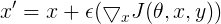
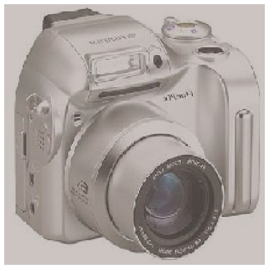
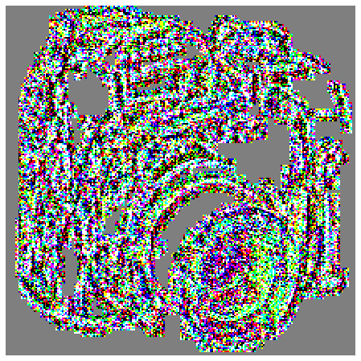
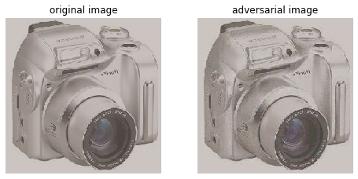

# FGSM-Tensorflow2-Caltech101

In this repository, we want to train a DNN for classification task on [Caltech101 dataset](http://www.vision.caltech.edu/Image_Datasets/Caltech101/) 
and attack the trained network using Fast Gradient Sign Method(FGSM) and fool the network.

Caltech101 dataset includes RGB pictures of 101 categories objects. About 40 to 800 images per category. Most categories have about 50 images.
We excluded a few of the categories from the dataset to have faster training.

<table align='center'>
<tr>
<td>
<td>
<td>
<td>
</tr>
</table>

<p align="center">
Some examples of Caltech101
</p>


Images in this dataset have different sizes. In training time we must have images with equal sizes. Hence we resize the images while loading them using keras.preprocessing.image.load_img and resize all the images to [224, 224, 3].

We implement our approach using [Tensorflow](https://www.tensorflow.org/) 2.0 framework.

First, we build our network. It is done using [Keras sequential model](https://www.tensorflow.org/api_docs/python/tf/keras/Sequential).

Here is the summary of our model.
```
_________________________________________________________________
Layer (type)                 Output Shape              Param #   
=================================================================
conv2d (Conv2D)              (None, 222, 222, 32)      896       
_________________________________________________________________
max_pooling2d (MaxPooling2D) (None, 111, 111, 32)      0         
_________________________________________________________________
conv2d_1 (Conv2D)            (None, 109, 109, 64)      18496     
_________________________________________________________________
max_pooling2d_1 (MaxPooling2 (None, 54, 54, 64)        0         
_________________________________________________________________
dropout (Dropout)            (None, 54, 54, 64)        0         
_________________________________________________________________
conv2d_2 (Conv2D)            (None, 52, 52, 128)       73856     
_________________________________________________________________
max_pooling2d_2 (MaxPooling2 (None, 26, 26, 128)       0         
_________________________________________________________________
conv2d_3 (Conv2D)            (None, 24, 24, 256)       295168    
_________________________________________________________________
max_pooling2d_3 (MaxPooling2 (None, 12, 12, 256)       0         
_________________________________________________________________
dropout_1 (Dropout)          (None, 12, 12, 256)       0         
_________________________________________________________________
flatten (Flatten)            (None, 36864)             0         
_________________________________________________________________
dense (Dense)                (None, 256)               9437440   
_________________________________________________________________
dropout_2 (Dropout)          (None, 256)               0         
_________________________________________________________________
dense_1 (Dense)              (None, 89)                22873     
=================================================================
Total params: 9,848,729
Trainable params: 9,848,729
Non-trainable params: 0
```

 - Dropout layers used to avoid overfitting. <br>
 - Maxpooling layers halve the width and height size. This reduces training time. <br>
 - In Conv layers we set the kernel_size to 3 and use the ReLu activation function. In each conv layer, we double the number of feature maps. <br>
 - **Note:** The last dense layer has 89 nodes. As I mentioned before we excluded some classes of the dataset. That's why we have 89 nodes instead of 101.


Then we [compile](https://www.tensorflow.org/tutorials/keras/classification#compile_the_model) our model. We use [Adam optimzier](https://www.tensorflow.org/api_docs/python/tf/keras/optimizers/Adam) and [SparseCategoricalCrossentropy loss](https://www.tensorflow.org/api_docs/python/tf/keras/losses/SparseCategoricalCrossentropy).

We train the model for 12 epochs. The model has already overfitted at this time and training it for more epochs does not improve the test accuracy.

The Accuracy is 68% for trainset and 37% for testset(Overfitting obviously occurred). We can improve the performance of the network by applying data augmentation or trying more complex architectures like ResNet and etc. However this accuracy is sufficient for our purpose.


## Fast Gradient Sign Method 

[Explaining and Harnessing Adversarial Examples](https://arxiv.org/abs/1412.6572) paper describes a new way of attacking networks called Fast Gradient Sign Method (FGSM).

Adversarial examples are specific inputs created with the purpose of fooling a neural network. They are formed by applying small perturbations to examples from the dataset, such that the 
perturbed input results in the model outputting an incorrect answer with high confidence. These examples are indistinguishable to the human eye.

FGSM is a white box attack whose goal is to ensure misclassification. A white box attack is where the attacker has complete access to the model being attacked.

The fast gradient sign method works by using the gradients of the neural network to create an adversarial example. 
For an input image, the method uses the gradients of the loss with respect to the input image to create a new image that 
maximizes the loss. This new image is called the adversarial image.

Here is the formulation of creating an adversarial image using FGSM.

<p align="center">
 <br>
</p>

<p align="center">

<br>

<sub>
By adding small perturbations the author creates an adversarial example and fools the network! It predicts a panda image as a gibbon with 99.3% confidence! The perturbations in the adversarial image are not distinguishable to the human eye.
</sub>
</p>


We create adversarial examples by taking the gradient of the network with respect to the input image.
```
def create_adversarial_pattern(input_image, input_label):
    loss_object = tf.keras.losses.CategoricalCrossentropy()

    with tf.GradientTape() as tape:
        tape.watch(input_image)
        prediction = probability_model(input_image)
        loss = loss_object(input_label, prediction)
    gradient = tape.gradient(loss, input_image)
    signed_grad = tf.sign(gradient)
    return signed_grad
```
tape.gradient(loss, input_image) does the deriviation computation.

Then we use an image of a camera to create an adversarial example and fool our trained network:
<table align='center'>
<tr align='center'>
<td> Original image </td>
<td> FGSM Perturbations </td>
</tr>
<tr>
<td>
<td>
</tr>
</table>


We want our model to return a probability. So we wrap the trained model, and attach the softmax to it:
```
probability_model = tf.keras.Sequential([
  model,
  tf.keras.layers.Softmax() 
])
```

Our model correctly predicted the original image with high confidence. 99.7% certainty!

However it fails to classify the adversarial image correctly and predicts it as a ball with 91% certainty!!
That's how FGSM works!

Here you can compare the adversarial and original images. They look very similar to us. Not to the network!

<p align="center">
 <br>
</p>

You can find and run our implementation in [fgsm_caltech101.ipynb](./fgsm_caltech101.ipynb). I didn't have the caltech101 dataset myself and ran the code in google Colab and loaded the dataset from http://www.vision.caltech.edu/.
You must change the cell for loading the dataset if you want to run it on your OS.


## References

[1] Ian J. Goodfellow, Jonathon Shlens, Christian Szegedy "Explaining and Harnessing Adversarial Examples" (https://arxiv.org/abs/1412.6572)

[2] https://www.tensorflow.org/tutorials/generative/adversarial_fgsm
